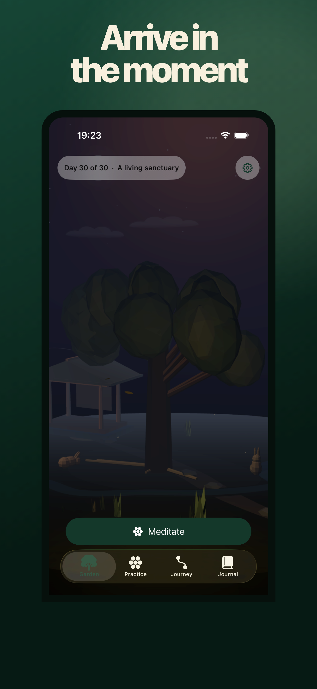
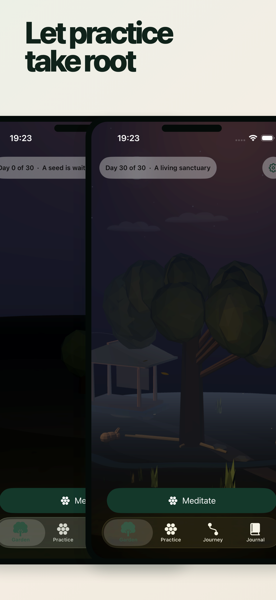

# Arrive Within

Arrive Within is a free, bilingual meditation app for iPhone and iPad. A configurable timer, an open-ended stopwatch, private reflections, and a deterministic living garden all work without an account. Every qualifying practice becomes one immutable event; the same event history always grows the same garden. The repository contains the complete original English/German guided-practice source and the approved narrated update; the submitted version 1.0 build 7 remains the earlier zero-narration App Review artifact.

<p align="center">
  
  &nbsp;
  
</p>

[Watch the silent garden-growth film](Marketing/PublicMedia/output/garden-growth-v1.mp4) · [Source](https://github.com/p0s/arrive-within) · [Architecture](docs/architecture/OVERVIEW.md) · [Contributing](CONTRIBUTING.md) · [Privacy](https://arrivewithin.com/privacy)

## Project status

Arrive Within 1.0 is in active pre-release verification of the narrated update. The submitted build 7 remains the exact zero-narration App Review candidate, and this repository does **not** claim App Store availability yet. The public repository now also contains the approved 84-track English/German narrated update (42 concepts × 2 languages), bound transcripts, provenance, and the refreshed bilingual screenshot source. Build 13 is uploaded and reads `VALID`, App Store eligible, and `IN_BETA_TESTING`; its exact physical iPad launch is verified, while owner audio listening and the next editable App Store metadata update remain separate gates. English F2 and German C2 are the selected narration directions, Quiet Threshold B is the packaged icon, and C — Twilight Refuge is the only shipping garden; A/B remain non-shipping source references.

There is no App Store download link until an exact reviewed candidate is actually available. The country-neutral URL is reserved as `https://apps.apple.com/app/id6800192697`; add it to this README and the website only after Apple approval and a successful storefront readback.

## What is here

- Two complete offline practice modes in version 1.0: timer and stopwatch; the submitted build 7 remains fail-closed for narration while the narrated update is prepared.
- Exactly 42 original guided concepts with approved English and German narration, transcripts, and provenance in `Content/guided`.
- A monotonic, persisted session state machine with exact-once completion.
- Permanent deterministic garden progression, a typed Swift/TypeScript bridge, bounded Three.js rendering, recovery, and a native fallback.
- Private text and voice journal paths with on-device transcription, search, edit, export, and deletion.
- Journey, history, statistics, milestones, selectable variants, reminders, app-local language selection, and adaptive iPad navigation.
- Local-only protected storage in 1.0 and one public-safe, fail-closed adapter for future private CloudKit work.
- Reproducible website, public-media, app-icon-concept, and 24-image App Store screenshot workstreams.

## Privacy in one paragraph

The app has no account, ads, analytics, attribution, tracking, custom backend, cloud sync, or runtime AI. Product data remains on the device unless the user deliberately exports it through Apple's system share sheet. Journal transcription is on device. Read the [published privacy policy](https://arrivewithin.com/privacy).

## Build locally

Requirements:

- macOS with Xcode and the iOS 18 or later SDK;
- Swift 6 and XcodeGen 2.46 or later;
- Node.js 26.7.0 and pnpm 11.20.0, matching the package manifests;
- XcodeGen, FFmpeg/ffprobe, jq, and Playwright Chromium for the complete local gate;
- no paid Apple account for simulator and unsigned local verification.

Install JavaScript dependencies from the pinned lockfiles:

```sh
pnpm --dir Renderer install --frozen-lockfile
pnpm --dir Marketing/AppStoreScreenshots install --frozen-lockfile
pnpm --dir Marketing/AppStoreScreenshots exec playwright install chromium
```

Generate the Xcode project and run the portable checks:

```sh
xcodegen generate
swift test --package-path Packages/ArriveWithinCore
pnpm --dir Renderer verify
python3 scripts/validate_guided_content.py
node scripts/validate_localizations.mjs
```

Open `ArriveWithin.xcodeproj`, select the shared `ArriveWithin` scheme, and run an iPhone or iPad simulator. Version 1.0 is local-only and does not need private credentials.

The complete local gate is:

```sh
./scripts/check
```

It includes full 84-track source validation and an unsigned iOS build, and therefore requires Xcode. The strict pre-TestFlight package gate is `ARRIVE_WITHIN_GUIDED_GATE=device-candidate ./scripts/check`; the current public source gate passes, and build 13 is in Internal Testing. Final narrated-release approval still requires owner confirmation of physical audio playback and the later App Store metadata opportunity. Simulator UI tests use the repository’s serialized guarded runner; do not start overlapping XCTest or simulator-control processes.

## Safe local configuration

`Config/Base.xcconfig` deliberately contains no team, profile, entitlement, or CloudKit container. Maintainers may copy `Config/Local.example.xcconfig` to ignored `Config/Local.xcconfig` for authorized local signing values only; version 1.0 does not bind the ignored entitlement file. Never commit local configuration, credentials, profiles, model weights, private voice material, or reference assets.

## Contribute to the product

This is the Arrive Within product repository, not a generic starter. Improvements to native behavior, renderer reliability/performance, original art, English/German guidance, localization, accessibility, privacy, and evidence-backed testing are welcome. Start with [CONTRIBUTING.md](CONTRIBUTING.md), then use the focused guides under [`docs/contributing`](docs/contributing/).

## Licenses

Project-owned code, documentation, and build tooling are licensed under [MIT](LICENSE). Covered original media is licensed separately under [CC BY 4.0](docs/legal/MEDIA_LICENSE.md). Bundled and development dependencies retain their own licenses and notices in [THIRD_PARTY_NOTICES.md](THIRD_PARTY_NOTICES.md); that notice file is also packaged with the app. These licenses do not grant trademark rights in the Arrive Within name, selected app icon, trade dress, or official identity.
