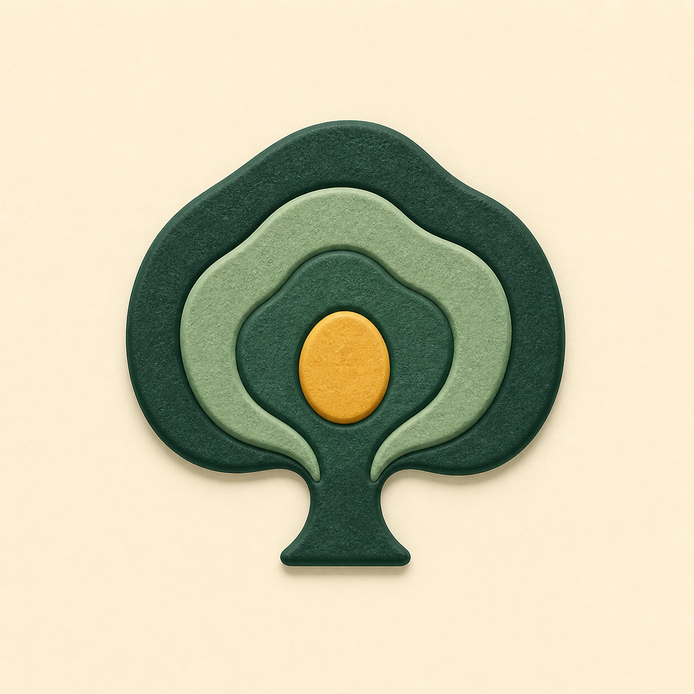
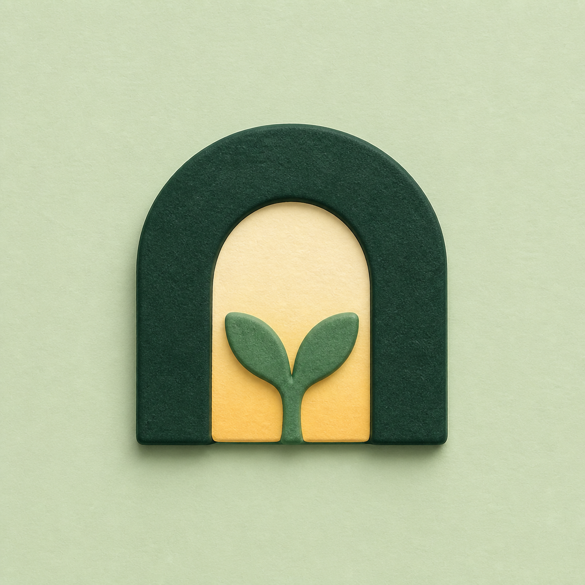
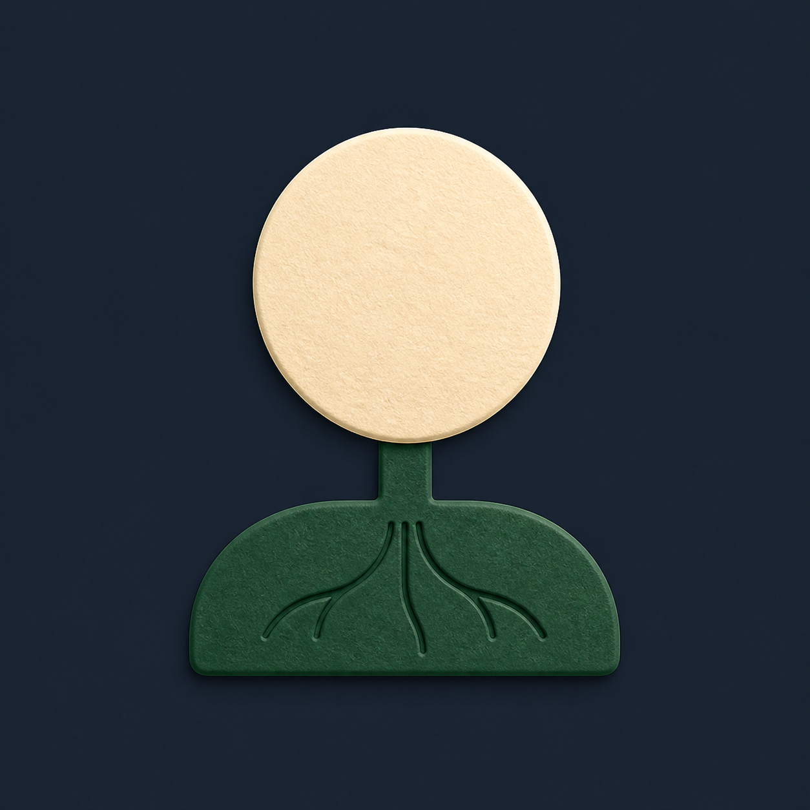

# Arrive Within app icon concept selection

Status: B — Quiet Threshold selected by the owner on 2026-08-10

These are three separately generated concept directions. They share only the approved first-party tactile material family; their meaning and geometry are Arrive Within-specific. This sheet records the decision; the selected concept itself is not the canonical layered source.

## A — Living Rings

A direct tree/canopy emblem built from organic growth rings with one dawn seed. It emphasizes practice accumulating into one living sanctuary.

## B — Quiet Threshold

A still architectural threshold with living growth inside. It emphasizes arriving inward and discovering growth, without a route or arrow.

## C — Rooted Light

A grounded rooted-seed base meeting one calm disc of light. It emphasizes practice taking root and becoming durable growth.

## Owner decision

- Selected direction: **B — Quiet Threshold**
- Selection date: **2026-08-10**
- Owner note: “Image 2” was verified against this sheet as B: the green architectural threshold/arch with the living shoot.
- Rejected directions: A — Living Rings; C — Rooted Light.

One refined production target, the named-layer `Apps/ArriveWithin/Resources/AppIcon.icon/` package, deterministic compatibility outputs, and Default/Dark/Tinted 1024/180/60/40 QA now preserve that decision. The two preserved rejected C attempts remain provenance only.
